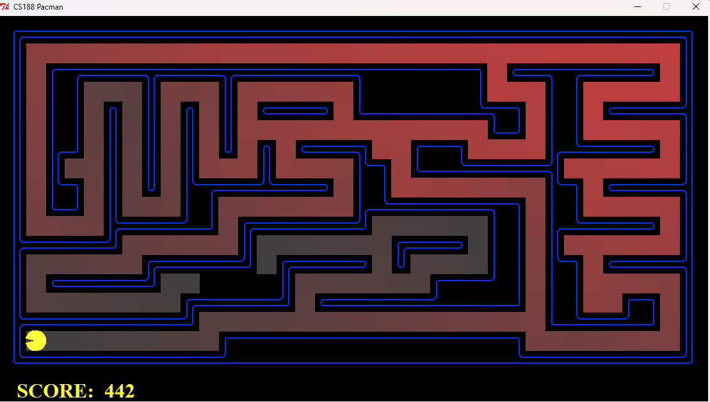
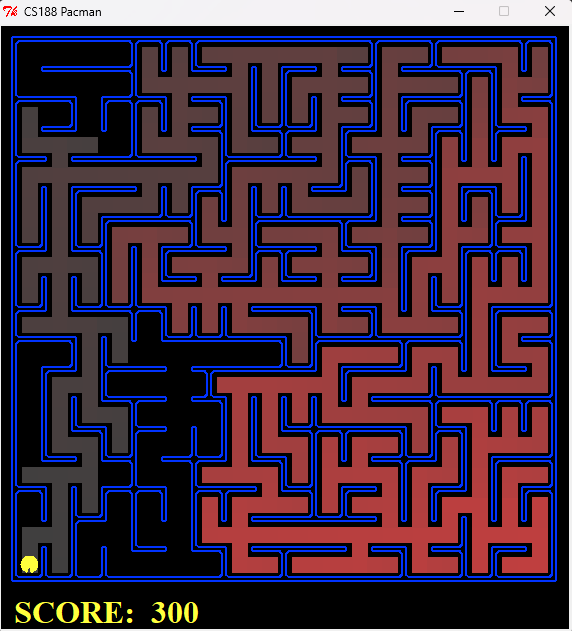

Project Link: [http://ai.berkeley.edu/project_overview.html](http://ai.berkeley.edu/project_overview.html)
###### **Requires Python 2.7**
# Berkeley CS 188 ‑ Project 1: **Pac‑Man Search**  

Solutions to the first Berkeley AI project: building general‑purpose search algorithms and applying them to guide Pac‑Man through a variety of maze challenges.  
*(All extra‑credit / bonus portions were **not** implemented.)*

---

## Table of Contents
1. [Project Overview](#project-overview)  
2. [Implemented Questions](#implemented-questions)  
3. [Installation & Setup](#installation--setup)  
4. [Running Pac‑Man](#running-pac-man)  
5. [Autograder](#autograder)  
6. [Sample Commands](#sample-commands)  
7. [Notes & Assumptions](#notes--assumptions)  
8. [License](#license)  

---

## Project Overview
The goal of Project 1 is to **design generic search algorithms**—Depth‑First Search, Breadth‑First Search, Uniform‑Cost Search, and A\*—then apply them to Pac‑Man scenarios such as:

* Navigating to a fixed location  
* Visiting all four corners of a maze  
* Collecting all food dots in the fewest steps  
* Quickly grabbing the *nearest* dot (sub‑optimal greedy strategy)

The project is entirely self‑contained and uses the CS 188 Pac‑Man code base supplied by UC Berkeley. Only two files require modification:

| File | Purpose |
|------|---------|
| `search.py` | Generic uninformed & informed search algorithms |
| `searchAgents.py` | Problem definitions, heuristics, and agents |

All other files serve as the game engine, display code, data structures, or the autograder.

---

## Implemented Questions
| Q # | Description | Key Work Completed |
|-----|-------------|--------------------|
| **1** | *Depth‑First Search* | Implemented **graph‑based DFS** in `depthFirstSearch()` |
| **2** | *Breadth‑First Search* | Implemented **graph‑based BFS** in `breadthFirstSearch()` |
| **3** | *Uniform‑Cost Search* | Implemented UCS in `uniformCostSearch()`; added cost functions for “Stay‑East” / “Stay‑West” agents |
| **4** | *A\* Search* | Implemented A\* in `aStarSearch()` and verified with `manhattanHeuristic` |
| **5** | *Corners Problem* | Defined `CornersProblem` state space & successor function |
| **6** | *Corners Heuristic* | Wrote **consistent, admissible** heuristic `cornersHeuristic()` |
| **7** | *Food Search* | Implemented `foodHeuristic()` for `FoodSearchProblem` (consistent, non‑trivial) |
| **8** | *Closest‑Dot Search* | Completed `findPathToClosestDot()` and goal test for `AnyFoodSearchProblem` |

> **Performance:** All autograder tests pass within the required node‑expansion limits; no bonus tasks attempted.

---

## Installation & Setup

**Clone repository**

```
   git clone https://github.com/jerinmulangan/pacman‑search.git
   cd pacman‑search
```

**Install Dependencies**

```bash
pip install pygame   # optional
```

## Running Pac‑Man

Launch a default game:

```bash
python pacman.py

# Show all available flags
python pacman.py -h
```

## Autograder

Check all questions:

```bash
python autograder.py

# Single test
python autograder.py -q q4
```

The autograder outputs **PASS/FAIL** along with node‑expansion statistics. The inal score equals the autograder total.

## Sample Commands

| Task                  | Command                                                                                     |
| --------------------- | ------------------------------------------------------------------------------------------- |
| DFS on `mediumMaze`   | `python pacman.py -l mediumMaze -p SearchAgent -a fn=dfs`                                   |
| BFS on `bigMaze`      | `python pacman.py -l bigMaze -p SearchAgent -a fn=bfs -z .5`                                |
| UCS with default cost | `python pacman.py -l mediumMaze -p SearchAgent -a fn=ucs`                                   |
| Stay‑East UCS         | `python pacman.py -l mediumDottedMaze -p StayEastSearchAgent`                               |
| A* (Manhattan)        | `python pacman.py -l bigMaze -p SearchAgent -a fn=astar,heuristic=manhattanHeuristic -z .5` |
| A* Corners            | `python pacman.py -l mediumCorners -p AStarCornersAgent -z .5`                              |
| A* Food Search        | `python pacman.py -l trickySearch -p AStarFoodSearchAgent`                                  |
| Greedy Closest‑Dot    | `python pacman.py -l bigSearch -p ClosestDotSearchAgent -z .5`                              |

*Use `--frameTime 0` to speed up visualizations.*

#### Examples

**UCS with default cost**

```
pacman> python pacman.py -l mediumMaze -p SearchAgent -a fn=ucs
[SearchAgent] using function ucs
[SearchAgent] using problem type PositionSearchProblem
Path found with total cost of 68 in 0.0 seconds
Search nodes expanded: 269
Pacman emerges victorious! Score: 442
Average Score: 442.0
Scores:        442.0
Win Rate:      1/1 (1.00)
Record:        Win
```




**A-Star Manhattan**

```
pacman> python pacman.py -l bigMaze -p SearchAgent -a fn=astar,heuristic=manhattanHeuristic -z .5
[SearchAgent] using function astar and heuristic manhattanHeuristic
[SearchAgent] using problem type PositionSearchProblem
Path found with total cost of 210 in 0.0 seconds
Search nodes expanded: 549
Pacman emerges victorious! Score: 300
Average Score: 300.0
Scores:        300.0
Win Rate:      1/1 (1.00)
Record:        Win
```


## Notes & Assumptions

- **Graph Search** (closed‑set) versions were used throughout to prevent state re‑expansion.
- All heuristics are **admissible & consistent**; empirical checks verified `f`–value monotonicity.
- The project targets **Python 2.7**; earlier and later versions are untested.


## License

MIT
University of California Berkeley